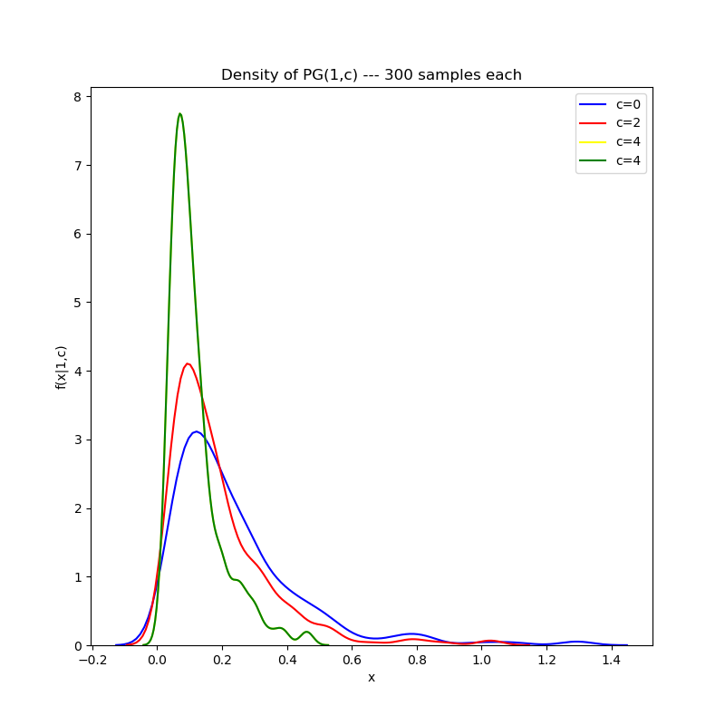
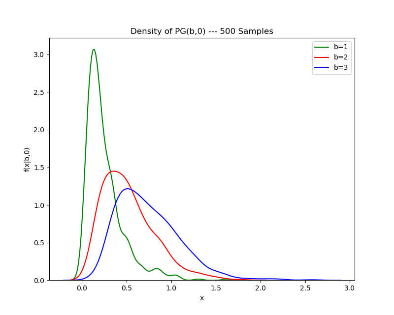

README --- polya-gamma-post
===========================

Code and IPython notebook accompanying my blog post on using Polya-Gamma-distributed random variables
for bayesian inference in logistic regression models.






## Requirements
* `cython >= 0.29.12`
* `numpy >= 1.16.4`
* `scipy.stats >= 1.3.0`

## Compilation & Usage
```
$ python setup.py build_ext --inplace
$ python
>>> from polya_gamma import polya_gamma_rv
>>> polya_gamma_rv(1, 0.)
0.24695957927207324
```
